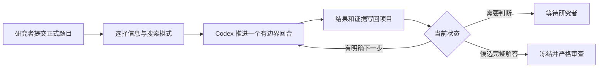

# Graph Geometry Research Workspace

让数学研究跨会话继续，并保留可审查的证据链。

[](https://github.com/coker412/graph-geometry-research-workspace/actions/workflows/ci.yml)
[](LICENSE)

这个工作台面向使用 Codex 进行证明搜索、反例构造、文献核查和计算实验的数学研究者。
它把题目、路线、证据、失败记录和下一步保存在项目目录中。研究可以跨越很多会话继续，
不必依赖一段不断增长的聊天记录。

[快速开始](#快速开始) · [查看示例](#先看一个完整示例) · [核心能力](#核心能力) ·
[运行模式](#运行模式) · [安全边界](#证据与安全边界)

## 适合谁

这个工作台适合需要长期推进数学问题，并且希望保留完整研究轨迹的个人研究者或小型团队。
它特别适合以下任务：

- 一个问题需要多个证明路线和多轮反例测试；
- 研究过程会跨会话、跨模型或跨 Agent；
- 候选证明必须和计算证据、文献事实、人工确认严格区分；
- 多道猜想需要在后台公平轮转，或需要专注运行其中一道题。

它不是自动证明正确性的保证，也不是新的数学模型。工作台负责组织 Codex 的研究过程，
数学研究者仍然负责确认定义、检查证明并决定是否公开结论。

## 快速开始

### 1. 获取工作台

```bash
git clone https://github.com/coker412/graph-geometry-research-workspace.git
cd graph-geometry-research-workspace
```

也可以在 GitHub 页面使用 **Use this template** 创建自己的副本。

### 2. 检查环境

```bash
./setup.sh --check
```

基础运行需要 Git、Bash、Python 3、Codex CLI 和 tmux。计算实验默认使用名为 `graphlab`
的 Conda 环境。缺少基础环境时，可以运行：

```bash
./setup.sh --bootstrap --without-rethlas
```

账户登录和联网安装需要由使用者亲自确认。不要复制其他人的 Codex 登录目录。

### 3. 加入一道题

```bash
./queue.sh add my-problem "My conjecture"
```

填写：

```text
problems/important-conjectures/items/my-problem/problem.md
```

核对同目录的 `config.toml`，再把：

```toml
ready = false
```

改为：

```toml
ready = true
```

题目原文由研究者维护。Runner 会保存输入快照，研究 Agent 不会改写原题。

### 4. 先跑一个回合

```bash
./queue.sh check
./queue.sh once
```

`check` 只检查环境和下一题，不调用 Codex。`once` 推进一个有边界的研究回合，适合确认
题目、权限和输出结构是否正确。

### 5. 需要时转入后台

```bash
./queue.sh start
```

```bash
./queue.sh status   # 查看状态
./queue.sh watch    # 查看输出，按 Ctrl-b 再按 d 退出查看
./queue.sh stop     # 当前回合结束后安全停止
```

后台模式使用 tmux。关闭终端不会终止任务。关机或系统休眠会停止或暂停计算，但磁盘状态仍会
保留，重新启动后可以继续。

## 先看一个完整示例

[`examples/tree-edge-count/`](examples/tree-edge-count/) 是一个虚构项目，问题是证明有限非空树
有 \(n-1\) 条边。它不包含任何真实研究内容，展示了以下文件如何互相引用：

```text
problem.md
    ↓
CURRENT_STATE.md
    ↓
ideas.md + research-tree.md + proof-map.md
    ↓
notes/proof.md
    ↓
verification-ledger.md + progress.md
```

示例中的候选证明保持为 `proof-draft`。即使论证看起来完整，工作台也不会自动把它升级为
人工确认的结果。

## 它解决什么

| 常见问题 | 工作台的处理方式 |
|---|---|
| 新会话不了解上次做到哪里 | `CURRENT_STATE.md` 保存当前问题边界、最小缺口和证据指针 |
| Agent 重复失败路线 | `ideas.md` 和 `research-tree.md` 记录方法族、失败原因与重开条件 |
| 未验证的引理逐渐变成默认前提 | `proof-map.md` 和 `verification-ledger.md` 保存依赖与证据等级 |
| 计算结果被误写成定理 | 计算证据最高先标为 `experimental` |
| 一道难题占用全部时间 | 队列按优先级公平轮转，也支持独立单题 runner |
| 模型声称解决问题后继续自动运行 | 完整候选解会冻结队列，等待研究者逐步复核 |

## 工作方式



每个 Codex 调用只负责一个有边界的回合。长期运行来自连续回合和磁盘状态，不是让一次
调用无限等待。每轮至少保存一项可复核产物，例如严格中间结果、精确 gap、反例候选、
已排除路线或可复现实验现象。

一个回合可以包含少量彼此独立的探索分支。根 Agent 选择一条主路线深入推进，并负责统一
写入共享状态。候选引理只冻结依赖它的分支；完整候选解答才会停止整道题的探索。

## 核心能力

| 能力 | 对应组件 |
|---|---|
| 可恢复研究回合 | `CURRENT_STATE.md`, `progress.md` |
| 方法族和失败路线管理 | `ideas.md`, `research-tree.md` |
| 候选证明依赖追踪 | `proof-map.md` |
| 数学证据分级 | `verification-ledger.md` |
| 多题轮转与单题长跑 | `tools/conjecture_queue.*`, `queue.sh` |
| 离线原创与联网核查隔离 | `offline`, `connected`, `mixed-isolated` |
| 可选的证明升级 | `tools/rethlas/` |
| 发布前隐私和完整性检查 | GitHub Actions, `tools/verify_teacher_framework.sh` |

`AGENTS.md` 保存所有任务共用的研究纪律。`agents/instructions/` 按研究、队列升级和论文写作
拆分详细规则。工作台不提供模型，而是调用已安装并登录的 Codex CLI。

## 运行模式

信息来源、搜索目标、调度方式、运行期限和研究阶段可以分别选择，不必绑定成固定套餐。

| 维度 | 选项 | 说明 |
|---|---|---|
| 信息来源 | `offline`, `connected`, `mixed-isolated` | 决定是否读取外部资料以及如何隔离来源 |
| Agent 策略 | `single`, `adaptive`, `swarm` | 决定回合内是否使用独立分支；目前不是 runner 配置字段 |
| 搜索目标 | `affirmative-proof`, `counterexample`, `either` | 决定寻找证明、反例或两者均可 |
| 调度 | 单回合、公平队列、独立单题 | 决定如何分配多个题目的运行时间 |
| 期限 | 有界试跑或持续运行 | 由单回合超时、累计回合和后台时限共同控制 |
| 阶段 | 探索或认证 | 候选结论和高风险引理会触发认证 |

### 信息来源

- `offline` 只使用正式题目、允许的基础事实、内部计算和可追踪状态。它不能用来判断文献
  状态或新颖性。
- `connected` 允许联网核查。外部定理必须核对原文、全部假设和归一化。
- `staged` 是人工流程：先运行若干离线回合并冻结路线快照，再切换为联网核查。
- `mixed-isolated` 同时运行离线分支和联网分支，最后执行汇合审计。它通常需要三次 Codex
  调用，并依赖 Linux `bubblewrap`。缺少隔离工具时会拒绝运行，不会静默降级。

全局模式写在 `problems/important-conjectures/runner.toml`，单题可以在自己的
`config.toml` 中覆盖：

```toml
information_mode = "offline"
search_contract = "either"
```

### 调度方式

| 目标 | 命令 |
|---|---|
| 检查但不运行 | `./queue.sh check` |
| 推进下一题一个回合 | `./queue.sh once` |
| 公平轮转所有可运行题目 | `./queue.sh start` |
| 后台专注一道题 | `./queue.sh start --slug <slug>` |
| 查看指定单题 | `./queue.sh watch --slug <slug>` |
| 安全停止指定单题 | `./queue.sh stop --slug <slug>` |

不同 slug 可以使用独立 tmux 并行运行。同一 slug 不能重复启动；公平队列也不能和独立
单题 runner 同时修改同一道题。

### 持续运行

将单题的 `max_attempts` 设为 `0` 可以取消累计回合上限，将全局 `max_wall_hours` 设为 `0`
可以取消一次后台启动的总时限。单个回合仍建议保留有限超时，以便从 CLI 故障或挂起计算
中恢复。

只要题目状态为 `queued` 或 `pushing`，Runner 就会继续调度。题目有歧义、需要升级、出现
运行故障或得到完整候选解答时，它会停下来等待研究者。持续调度不能保证任意数学问题都能
找到完整解答，也会持续消耗模型额度。

完整配置、常用组合和固定研究提示词见
[`problems/important-conjectures/README.md`](problems/important-conjectures/README.md)。

## 每道题会生成什么

第一次调度时，Runner 会建立：

```text
projects/conjecture-<slug>/
├── README.md
├── CURRENT_STATE.md
├── references.md
├── ideas.md
├── progress.md
├── research-tree.md
├── proof-map.md
├── verification-ledger.md
├── notes/
├── code/
├── lean/
├── rethlas/
├── input-snapshots/
├── CURRENT_INPUT.md
└── .conjecture-status
```

### 短状态与历史

`CURRENT_STATE.md` 是下一回合的默认入口，最多 300 行、32 KiB。Agent 先读正式题目和这份
摘要，再按稳定 ID 和路径读取直接证据，不必完整重读持续增长的历史文件。

旧项目可以运行：

```bash
./queue.sh state-init
./queue.sh state-audit
```

队列外的普通项目使用：

```bash
./tools/project_state.py init
./tools/project_state.py audit
```

初始化不会覆盖已有摘要。旧项目先标为 `migration-status: pending`，再从最近完整回合和直接
证据建立保守摘要。未读历史按未知处理，不会自动改变证据等级。

### 空间治理

```bash
./queue.sh hygiene report
./queue.sh hygiene latex
./queue.sh hygiene logs --older-than-days 30 --keep-latest-per-slug 5
```

这些命令默认只报告或显示计划。只有显式增加 `--apply`，工具才会删除可再生的 LaTeX
中间文件或无损压缩旧 JSONL 日志。项目环境只报告占用，不会自动删除。

## 证据与安全边界

### 证据等级

| 等级 | 含义 |
|---|---|
| `conjecture` | 没有证明 |
| `experimental` | 只有计算证据 |
| `partial-result` | 只证明特殊情形或较弱结论 |
| `proof-draft` | 有完整候选证明，尚未严格验证 |
| `agent-verified` | 通过独立 Agent 或 verifier 审查 |
| `human-verified` | 研究者逐步复核并明确接受 |
| `formalized` | 通过 Lean 等形式系统检查 |

计算实验不能直接写成定理。Codex 或 Rethlas 给出的完整论证最高先标为 `proof-draft` 或
`agent-verified`。只有研究者能够把它升级为 `human-verified`。

### 公开仓库不包含研究数据

这个仓库只发布框架、模板、工具、测试和虚构示例。`projects/`、`archive/`、`shared/`、
`index/`、`library/` 和 `environments/` 在公开源码中必须保持为空，只保留 `.gitkeep`。

提交前运行：

```bash
python tools/update_manifest.py write
./tools/verify_teacher_framework.sh --public-source
python -m unittest discover -s tools/tests -v
```

校验器会拒绝数据目录中的非占位文件、PDF、JSONL、常见密钥文件和未登记的源码文件。
GitHub Actions 会在每次 push 和 pull request 上重复测试、边界检查和完整分发包导出。

对于公开发布的通用框架，本仓库是规范源。私有研究工作区可以保留运行副本和本地扩展，
但不能把私有目录递归复制进公开仓库。

## 关于 Rethlas

普通队列只需要 Codex。Rethlas 是可选的证明求解和验证引擎，用于已经压缩成精确命题的
证明缺口。每次运行都需要研究者明确批准，并且应安装在本工作区之外。

队列不会自行启动 Rethlas，也不会因为模型声称找到证明就宣布问题已经解决。安装、tmux
运行和结果回流见 [`RETHLAS使用教程.md`](RETHLAS使用教程.md)。

## 研究范围

默认规范主要面向离散几何和几何分析，包括图上的曲率、离散 Ricci 曲率与 Einstein 条件、
图拉普拉斯与谱几何、离散几何流，以及图的局部变换和极限行为。

目录、队列和证据规则不依赖这些具体方向。修改 `AGENTS.md` 和项目模板后，也可以用于其他
需要长期证明搜索或计算实验的数学问题。

## 文档

- [队列快速说明](TEACHER_QUEUE_QUICKSTART.md)：日常命令的一页说明
- [环境配置说明](TEACHER_SETUP_README.md)：环境配置与交接
- [重要猜想队列](problems/important-conjectures/README.md)：状态机、运行模式和恢复方式
- [研究规则](AGENTS.md)：证据、审计与权限边界
- [AI 配置任务书](SETUP_AI_PROMPT.md)：可以直接交给 Codex 的环境配置说明

## License

MIT License。可以复制、修改和再发布，但需要保留版权及许可声明。
