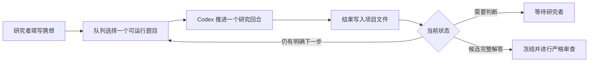

# Graph Geometry Research Workspace

这是一个面向数学研究者的 AI 辅助研究工作台，目前主要用于离散几何和几何分析。

工作台把一次长期研究拆成可恢复的回合：`AGENTS.md` 规定研究纪律，项目目录保存长期状态，猜想队列负责调度。每个回合都有明确边界，结束时把结果、失败路线、证据等级和下一缺口写回磁盘。下一回合不依赖旧聊天，而是从这些文件继续。

我更关心研究过程能不能留下可靠记录。定义是否一致，一条路线为什么失败，计算结果支持了什么，候选证明还有哪个 gap，这些都不应该随着对话结束而消失。这个仓库就是为此逐渐整理出来的，目前仍在实际使用中调整。

工作台本身不提供新的模型。它调用 Codex 做文献、实验和证明搜索，数学研究者负责选择运行模式、控制额度、检查证明并决定结论的证据等级。

## 它包含什么

| 部分 | 作用 |
|---|---|
| [`AGENTS.md`](AGENTS.md) | 保存所有任务都必须遵守的核心规则 |
| [`agents/instructions/`](agents/instructions/) | 按任务拆分研究流程、推理升级和论文写作细则 |
| `projects/` | 每个研究项目的长期工作目录 |
| `problems/important-conjectures/` | 投放和配置重要猜想 |
| `tools/conjecture_queue.*` | 按优先级轮转猜想，每次只运行一个有边界的 Codex 回合 |
| `progress.md` 与 `ideas.md` | 保存推进过程、失败路线和下一步 |
| `research-tree.md` 与 `proof-map.md` | 分别记录探索路线和候选证明的依赖关系 |
| `verification-ledger.md` | 记录数学结论的证据等级、反例测试和审查结果 |
| `tools/rethlas/` | 可选的 Rethlas 包装脚本，仅在研究者明确批准后使用 |
| `setup.sh` | 检查或配置新的工作环境 |

这个公开仓库只包含框架，不包含我的研究项目、论文、PDF、实验数据、运行日志或登录信息。

## 先选择运行方式

模式分成六个互相独立的维度。信息来源、Agent 强度、搜索目标、调度方式、运行期限和研究阶段可以分别选择，
不必捆绑。例如，可以运行“离线 + adaptive + 反例搜索 + 单题专注”，也可以运行
“混合隔离 + single + 双向搜索 + 公平队列”。

| 维度 | 可选项 | 默认或当前行为 | 在哪里设置 |
|---|---|---|---|
| 信息来源 | `offline`、`connected`、`mixed-isolated`，以及人工分阶段的 `staged` | 默认由 `runner.toml` 决定，新工作区通常从离线开始 | `runner.toml` 或单题 `config.toml` 的 `information_mode` |
| Agent 强度 | `single`、`adaptive`、`swarm` | `adaptive` 是当前提示词策略 | 目前写入题目要求或 `AGENTS.md`；还不是 runner 配置字段 |
| 搜索目标 | `affirmative-proof`、`counterexample`、`either` | 新题模板默认为 `affirmative-proof` | 单题 `config.toml` 的 `search_contract` |
| 调度方式 | 单回合、公平后台队列、前台单题专注 | `start` 使用公平队列 | CLI 命令；后台 `focus/pin` 尚未实现 |
| 运行期限 | 有界试跑、持续到完整结果 | 新题累计回合默认不限；一次 `start` 默认运行至多 24 小时 | 单题 `config.toml`、`runner.toml` 与题目状态 |
| 研究阶段 | 探索、认证 | 先探索；候选结论触发分支认证 | 由工作流自动切换，也可由研究者明确要求审计 |

这些名称并不都代表已经实现的命令行开关。`information_mode` 和 `search_contract` 是正式
配置字段；`single`、`adaptive`、`swarm` 是 Agent 编排策略；`staged` 是研究者主动切换
信息模式形成的流程。文档中会明确区分三者。

### 信息来源

| 模式 | 行为 | 适合什么情况 | 额度与限制 |
|---|---|---|---|
| `offline` | 禁止公共互联网、连接器和新增外部数据源，只使用题目、允许的基础事实、内部计算与可追踪状态 | 原创证明搜索、担心热门错误路线造成锚定时 | 一次普通 Codex 回合；不能据此判断文献状态或新颖性 |
| `connected` | 允许联网核查，外部材料必须记录来源并逐项核对假设 | 文献核查、定理接口确认、优先权检查 | 一次普通 Codex 回合；外部路线不能替代关键证明 |
| `staged` | 先运行若干 `offline` 回合并冻结原创路线快照，再人工改为 `connected` | 希望先独立搜索，之后再吸收文献 | 不是单独配置值，需要研究者在阶段边界改配置 |
| `mixed-isolated` | 离线探索和联网核查并行，之后运行独立汇合审计 | 同一阶段同时需要原创搜索与外部核查 | 基础成本约为三次 Codex 调用；需要 Linux `bubblewrap`，缺失时拒绝运行 |

全局选择写在 `problems/important-conjectures/runner.toml`：

```toml
information_mode = "offline"
```

单题可以覆盖全局设置：

```toml
information_mode = "mixed-isolated"
```

`mixed-isolated` 的联网分支只能读取回合开始时的冻结副本。它不能看到离线分支的实时文件，
也不能写入真实项目。两个分支结束后，runner 才启动汇合审计。

### Agent 强度

| 策略 | 行为 | 相对消耗 |
|---|---|---:|
| `single` | 根 Agent 独立完成一个回合，不主动调用子 Agent | 低 |
| `adaptive` | 根 Agent 深入一条主路线，并按路线分叉、关键缺口和审计需要动态调用少量子 Agent | 中，当前推荐 |
| `swarm` | 同时保留多个不兼容的探索分支，并持续配置对抗审计 | 高 |

普通队列每次只启动一个根 Agent，但根 Agent 可以在回合内部并行调用子 Agent。因此“队列
串行”和“回合内多 Agent”并不矛盾。候选引理只冻结依赖它的分支，无依赖的盲分支可以
继续；完整候选解答才会冻结整个题目。

这三个策略目前不是 `runner.toml` 字段。需要固定 `single` 或启用高强度 `swarm` 时，应把
要求写入题目或工作区指令。默认长跑提示词采用 `adaptive`，根据额度和信息增益决定是否
增加分支。

### 搜索目标

单题 `config.toml` 使用 `search_contract`：

```toml
search_contract = "affirmative-proof"
```

- `affirmative-proof`：把完整肯定证明作为搜索终点，适合需要避免过早放弃的长跑。
- `counterexample`：持续寻找并认证足以否定命题的严格反例。
- `either`：接受完整证明或严格反例中的任一种完整解决。

搜索目标只控制路线选择，不提高证据等级。即使使用 `affirmative-proof`，未经审计的完整
论证仍然只是 `proof-draft`。

### 调度方式

| 方式 | 命令 | 行为 |
|---|---|---|
| 检查下一回合 | `./queue.sh check` | 只做健康检查和 dry run，不调用 Codex |
| 单回合 | `./queue.sh once` | 前台运行队列中的下一个可运行题目，然后退出 |
| 公平后台队列 | `./queue.sh start` | 在 tmux 中按优先级完成一轮，每题最多一个回合，再重新扫描 |
| 前台单题专注 | `./tools/conjecture_queue.sh run --slug <slug>` | 只反复调度指定题目，终端必须保持打开 |

当前 `start` 总是公平轮转，`priority` 只决定一轮中的先后次序，不表示永久锁定某题。后台
`focus/pin` 尚未实现。需要后台单题长跑时，可以自行在 tmux 中运行上面的 `--slug`
命令；在正式加入专用命令前，README 不把它描述成已有模式。

### 探索与认证

探索是默认阶段，可以提出高风险引理、构造和反例候选，但必须留下明确状态。某个分支
出现严格中间结果、完整候选证明或高风险公共依赖时，该分支进入认证：冻结下游，执行
十项检查，并交给独立 Agent 或 verifier 审计。其他无依赖分支可以继续运行。

认证不是“更强的搜索模式”，而是证据升级门。计算结果不能越过 `experimental`，单个
Agent 的完整自检不能自动成为 `human-verified`。

### 持续运行直到得到完整结果

这里的“持续”是多个可恢复研究回合连续运行，不是让一次 Codex 调用永远不返回。每个
回合仍须保存严格中间结果、失败路线、精确缺口和下一步。只要题目状态保持 `pushing`，
runner 就会在后续轮次继续研究。

“完整结果”是以下两种情况之一：

- 给出覆盖原命题全部量词的完整证明，并通过独立对抗审计；
- 给出严格反例，核对所有对象、边界条件和数值不等式，并通过独立对抗审计。

达到其中一种情况后，Agent 把题目设为 `solved-awaiting-human-verification`。runner 随即
停止，等待研究者逐步复核。归约到未证明引理、有限参数扫描、候选反例或单个 Agent 的
自检都不满足终止条件。

单题配置可以这样写：

```toml
ready = true
enabled = true
search_contract = "affirmative-proof"  # 也可改成 counterexample 或 either
stagnation_rounds_before_blocked = 0
information_mode = "offline"
max_attempts = 0
priority = 1000
```

全局配置负责取消一次后台启动的总时限：

```toml
max_wall_hours = 0
```

不必取消单回合超时。保留有限的 `attempt_timeout_minutes` 更容易从 CLI 故障、挂起计算或
不完整输出中恢复。长期性来自连续回合和磁盘状态，而不是单次调用时长。

如果队列中只有这道题，可以使用 `./queue.sh start`。如果队列中还有其他题，`start` 会
公平轮转。当前可用的单题专注命令是：

```bash
./tools/conjecture_queue.sh run --slug <slug>
```

它在前台运行。需要关闭终端后继续时，可以从仓库根目录手动放入 tmux：

```bash
tmux new-session -d -s conjecture_focus \
  './tools/conjecture_queue.sh run --slug <slug>'
```

查看和退出查看：

```bash
tmux attach -t conjecture_focus
# 按 Ctrl-b，再按 d，只退出查看，不停止研究
```

安全停止会等当前回合写完文件：

```bash
./tools/conjecture_queue.sh stop
```

再次执行同一个 `run --slug` 命令即可从项目文件继续。后台 `focus/pin` 仍计划做成正式
命令，目前上述 tmux 方法只是对已有 `--slug` 功能的直接使用。

下面这段可以放进题目的“给研究 Agent 的固定要求”。它适用于离线肯定证明长跑：

```text
仅使用题目、明确允许的基础事实、内部计算和可追踪的项目状态；不要搜索公共互联网、
连接器或外部资料。把“存在完整肯定证明”作为搜索工作假定，但不要把该假定当作证据。

持续推进多个可恢复研究回合，直到得到覆盖原命题全部量词的完整证明，并通过独立对抗
审计。不得因为问题可能公开、当前路线失败或出现定理级缺口而停止。每个回合结束前都要
保存最强的严格中间结果、失败路线、精确缺口、方法族登记和下一步，并保持题目为
`pushing`；不要为了等待完整证明而隐去部分进展。

根 Agent 每轮选择一条主路线深入推进，并按信息增益动态调用少量子 Agent。早期盲分支
只接收独立问题包，不暴露热门路线和失败史。先形成至少三个核心机制不同的方法族。候选
引理只冻结依赖它的分支，其他无依赖分支可以继续。候选完整证明必须另交独立 Agent
逐步检查定义、量词、边界情形、隐含假设、循环论证和与原命题等强的未证明引理。

只有完整证明通过审计后，才把状态改为 `solved-awaiting-human-verification`。归约、有限
计算、未经证明的关键引理和“尽力而为”的总结都不算完成。
```

寻找反例时，把配置改为：

```toml
search_contract = "counterexample"
```

并把提示词中的终点替换为：

```text
持续寻找足以否定原命题的严格反例。只有显式构造、全部对象与边界条件核对、决定性不等式
获得严格证书，并通过独立对抗审计后，才把状态改为
`solved-awaiting-human-verification`。有限扫描和没有证明证书的候选反例不算完成。
```

这套设置会一直消耗模型额度，直到得到完整候选结果、研究者安全停止，或发生需要人工
处理的状态，例如题目歧义、运行故障或升级申请。它保证持续调度和完整记录，不保证某个
数学问题一定存在可找到的解答。

### 常用组合

额度敏感的原创搜索：

```toml
information_mode = "offline"
search_contract = "either"
```

在题目要求中指定 `single`，再用 `./queue.sh once` 做短回合。

持续的原创证明长跑：

```toml
information_mode = "offline"
search_contract = "affirmative-proof"
max_attempts = 0
stagnation_rounds_before_blocked = 0
```

采用 `adaptive`，并把 `runner.toml` 的 `max_wall_hours` 设为 `0`。如果只研究一道题，使用
`run --slug <slug>`；`start` 会轮转所有可运行题目。

先原创、后核查：先以 `offline` 运行并保存方法族快照，在阶段边界改为 `connected`。
需要同回合并行核查时，选择 `mixed-isolated`，并预留约三次普通调用的基础额度。

## 工作方式



队列不依赖某一次聊天的上下文。每轮结束后，定义、文献、实验、证明草稿、失败原因和下一步都会保存在项目目录中。下一次 Codex 调用先读这些文件，再从当前最小缺口继续。

一个研究回合不等于只能研究一个思路。根 Agent 会选一条主路线深入推进，并可在额度允许
时动态启动少量盲探索分支。分支使用各自的问题包和输出目录，根 Agent 仍是共享台账的
唯一写入者。某条路线得到候选引理时，只冻结依赖该引理的分支并交给对抗审计；无依赖的
隔离分支可以继续。完整候选解答才会停止全题探索。

队列会公平轮转多个题目，避免一个难题占用所有时间。它只会自动继续 `queued` 和 `pushing` 状态。题目有歧义、需要升级工具、出现运行故障或得到完整候选解答时，会停下来等待研究者。

## 快速开始

### 1. 创建自己的副本

在 GitHub 页面点击 **Use this template**，或者直接克隆：

```bash
git clone https://github.com/coker412/graph-geometry-research-workspace.git
cd graph-geometry-research-workspace
```

### 2. 检查环境

```bash
./setup.sh --check
```

常用依赖包括 Git、Bash、Python 3、Codex CLI 和 tmux。计算实验默认使用名为 `graphlab` 的 Conda 环境。Rethlas 是可选组件，不影响普通 Codex 队列运行。

如果需要创建基础 Conda 环境：

```bash
./setup.sh --bootstrap --without-rethlas
```

联网安装和账户登录应由使用者自己确认。不要复制其他人的 Codex 登录目录。

### 3. 加入一道猜想

```bash
./queue.sh add hadwiger "Hadwiger conjecture"
```

填写题目：

```text
problems/important-conjectures/items/hadwiger/problem.md
```

然后把同目录 `config.toml` 中的：

```toml
ready = false
```

改为：

```toml
ready = true
```

题目原文由研究者维护。Runner 会保存输入快照，研究 Agent 不应改写原题。

### 4. 先运行一个回合

```bash
./queue.sh check
./queue.sh once
```

`once` 只推进一个 Codex 回合，适合检查提示词、权限和项目结构是否符合预期。

### 5. 在后台持续运行

```bash
./queue.sh start
```

常用管理命令：

```bash
./queue.sh status   # 查看队列状态
./queue.sh watch    # 查看实时输出，按 Ctrl-b 再按 d 退出
./queue.sh stop     # 当前回合结束后安全停止
```

后台模式使用 tmux。关闭终端不会终止任务，但关机或系统休眠仍会让任务停止或暂停。队列状态保存在磁盘上，重新启动后可以继续。

## 每道猜想会生成什么

第一次调度某道题时，Runner 会创建：

```text
projects/conjecture-<slug>/
├── README.md
├── references.md
├── ideas.md
├── progress.md
├── verification-ledger.md
├── research-tree.md
├── proof-map.md
├── notes/
├── code/
├── lean/
├── rethlas/
├── input-snapshots/
├── CURRENT_INPUT.md
└── .conjecture-status
```

这些文件不是为了把研究过程写得很繁琐，而是为了防止几个常见问题：失败路线被忘记，未经验证的引理悄悄变成前提，以及模型换了会话以后从头重复同一条错误路线。

## 证明状态

仓库使用以下证据等级：

1. `conjecture`
2. `experimental`
3. `partial-result`
4. `proof-draft`
5. `agent-verified`
6. `human-verified`
7. `formalized`

计算实验不能直接写成定理。Codex 或 Rethlas 给出的完整论证也只会先记为 `proof-draft` 或 `agent-verified`。只有研究者逐步复核并明确接受，才能标为 `human-verified`；Lean 等形式系统检查通过后才是 `formalized`。

核心规则见 [`AGENTS.md`](AGENTS.md)，具体流程按任务放在 [`agents/instructions/`](agents/instructions/) 中。两者共同规定了定义审计、文献核查、反例搜索、十项证明验证和 Rethlas 升级边界。

## 关于 Rethlas

普通队列只需要 Codex。Rethlas 用于处理已经压缩成精确命题的证明缺口，并且每次运行都需要研究者明确批准。它应安装在本工作区之外，相关命令和目录约定见 [`RETHLAS使用教程.md`](RETHLAS使用教程.md)。

队列不会自行启动 Rethlas，也不会因为模型声称找到证明就宣布问题已经解决。

## 目前的研究范围

当前工作区主要围绕离散几何和几何分析展开，现有规范特别关注图上的曲率、离散 Ricci 曲率与 Einstein 条件、图拉普拉斯与谱几何、离散几何流，以及图的局部变换和极限行为。

目录结构和猜想队列并不依赖这些具体方向。修改 `AGENTS.md`、项目模板和证据规则后，也可以用于其他需要长期证明搜索或计算实验的数学问题。

## 更详细的文档

- [队列快速说明](TEACHER_QUEUE_QUICKSTART.md)：日常队列命令的一页说明
- [环境配置说明](TEACHER_SETUP_README.md)：完整环境配置与交接说明
- [`problems/important-conjectures/README.md`](problems/important-conjectures/README.md)：调度规则、状态机和恢复方式
- [`SETUP_AI_PROMPT.md`](SETUP_AI_PROMPT.md)：可以直接交给 Codex 的环境配置任务书

## License

MIT License。可以复制、修改和再发布，但需要保留版权及许可声明。
