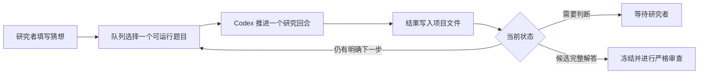

# Graph Geometry Research Workspace

这是一个面向数学研究者的 AI 辅助研究工作台，目前主要用于离散几何和几何分析。

工作台的核心很简单：`AGENTS.md` 写研究规范，项目目录保存长期状态，猜想队列让 Codex 分轮推进问题。每次调用只做一个有边界的研究回合，结果写回磁盘，下一轮再从留下的缺口继续。

我更关心研究过程能不能留下可靠记录。定义是否一致，一条路线为什么失败，计算结果支持了什么，候选证明还有哪个 gap，这些都不应该随着对话结束而消失。这个仓库就是为此逐渐整理出来的，目前仍在实际使用中调整。

工作台本身不提供新的模型。它调用 Codex 做文献、实验和证明搜索，数学研究者负责选择问题、检查证明并决定结论的证据等级。

## 它包含什么

| 部分 | 作用 |
|---|---|
| [`AGENTS.md`](AGENTS.md) | 保存所有任务都必须遵守的核心规则 |
| [`agents/instructions/`](agents/instructions/) | 按任务拆分研究流程、推理升级和论文写作细则 |
| `projects/` | 每个研究项目的长期工作目录 |
| `problems/important-conjectures/` | 投放和配置重要猜想 |
| `tools/conjecture_queue.*` | 按优先级轮转猜想，每次只运行一个有边界的 Codex 回合 |
| `progress.md` 与 `ideas.md` | 保存推进过程、失败路线和下一步 |
| `research-tree.md` 与 `proof-map.md` | 分别记录探索路线和候选证明的依赖关系 |
| `verification-ledger.md` | 记录数学结论的证据等级、反例测试和审查结果 |
| `tools/rethlas/` | 可选的 Rethlas 包装脚本，仅在研究者明确批准后使用 |
| `setup.sh` | 检查或配置新的工作环境 |

这个公开仓库只包含框架，不包含我的研究项目、论文、PDF、实验数据、运行日志或登录信息。

## 工作方式



队列不依赖某一次聊天的上下文。每轮结束后，定义、文献、实验、证明草稿、失败原因和下一步都会保存在项目目录中。下一次 Codex 调用先读这些文件，再从当前最小缺口继续。

一个研究回合不等于只能研究一个思路。根 Agent 会选一条主路线深入推进，并可在额度允许
时动态启动少量盲探索分支。分支使用各自的问题包和输出目录，根 Agent 仍是共享台账的
唯一写入者。某条路线得到候选引理时，只冻结依赖该引理的分支并交给对抗审计；无依赖的
隔离分支可以继续。完整候选解答才会停止全题探索。

队列会公平轮转多个题目，避免一个难题占用所有时间。它只会自动继续 `queued` 和 `pushing` 状态。题目有歧义、需要升级工具、出现运行故障或得到完整候选解答时，会停下来等待研究者。

## 快速开始

### 1. 创建自己的副本

在 GitHub 页面点击 **Use this template**，或者直接克隆：

```bash
git clone https://github.com/coker412/graph-geometry-research-workspace.git
cd graph-geometry-research-workspace
```

### 2. 检查环境

```bash
./setup.sh --check
```

常用依赖包括 Git、Bash、Python 3、Codex CLI 和 tmux。计算实验默认使用名为 `graphlab` 的 Conda 环境。Rethlas 是可选组件，不影响普通 Codex 队列运行。

如果需要创建基础 Conda 环境：

```bash
./setup.sh --bootstrap --without-rethlas
```

联网安装和账户登录应由使用者自己确认。不要复制其他人的 Codex 登录目录。

### 3. 加入一道猜想

```bash
./queue.sh add hadwiger "Hadwiger conjecture"
```

填写题目：

```text
problems/important-conjectures/items/hadwiger/problem.md
```

然后把同目录 `config.toml` 中的：

```toml
ready = false
```

改为：

```toml
ready = true
```

题目原文由研究者维护。Runner 会保存输入快照，研究 Agent 不应改写原题。

### 4. 先运行一个回合

```bash
./queue.sh check
./queue.sh once
```

`once` 只推进一个 Codex 回合，适合检查提示词、权限和项目结构是否符合预期。

### 5. 在后台持续运行

```bash
./queue.sh start
```

常用管理命令：

```bash
./queue.sh status   # 查看队列状态
./queue.sh watch    # 查看实时输出，按 Ctrl-b 再按 d 退出
./queue.sh stop     # 当前回合结束后安全停止
```

后台模式使用 tmux。关闭终端不会终止任务，但关机或系统休眠仍会让任务停止或暂停。队列状态保存在磁盘上，重新启动后可以继续。

## 每道猜想会生成什么

第一次调度某道题时，Runner 会创建：

```text
projects/conjecture-<slug>/
├── README.md
├── references.md
├── ideas.md
├── progress.md
├── verification-ledger.md
├── research-tree.md
├── proof-map.md
├── notes/
├── code/
├── lean/
├── rethlas/
├── input-snapshots/
├── CURRENT_INPUT.md
└── .conjecture-status
```

这些文件不是为了把研究过程写得很繁琐，而是为了防止几个常见问题：失败路线被忘记，未经验证的引理悄悄变成前提，以及模型换了会话以后从头重复同一条错误路线。

## 证明状态

仓库使用以下证据等级：

1. `conjecture`
2. `experimental`
3. `partial-result`
4. `proof-draft`
5. `agent-verified`
6. `human-verified`
7. `formalized`

计算实验不能直接写成定理。Codex 或 Rethlas 给出的完整论证也只会先记为 `proof-draft` 或 `agent-verified`。只有研究者逐步复核并明确接受，才能标为 `human-verified`；Lean 等形式系统检查通过后才是 `formalized`。

核心规则见 [`AGENTS.md`](AGENTS.md)，具体流程按任务放在 [`agents/instructions/`](agents/instructions/) 中。两者共同规定了定义审计、文献核查、反例搜索、十项证明验证和 Rethlas 升级边界。

## 关于 Rethlas

普通队列只需要 Codex。Rethlas 用于处理已经压缩成精确命题的证明缺口，并且每次运行都需要研究者明确批准。它应安装在本工作区之外，相关命令和目录约定见 [`RETHLAS使用教程.md`](RETHLAS使用教程.md)。

队列不会自行启动 Rethlas，也不会因为模型声称找到证明就宣布问题已经解决。

## 目前的研究范围

当前工作区主要围绕离散几何和几何分析展开，现有规范特别关注图上的曲率、离散 Ricci 曲率与 Einstein 条件、图拉普拉斯与谱几何、离散几何流，以及图的局部变换和极限行为。

目录结构和猜想队列并不依赖这些具体方向。修改 `AGENTS.md`、项目模板和证据规则后，也可以用于其他需要长期证明搜索或计算实验的数学问题。

## 更详细的文档

- [队列快速说明](TEACHER_QUEUE_QUICKSTART.md)：日常队列命令的一页说明
- [环境配置说明](TEACHER_SETUP_README.md)：完整环境配置与交接说明
- [`problems/important-conjectures/README.md`](problems/important-conjectures/README.md)：调度规则、状态机和恢复方式
- [`SETUP_AI_PROMPT.md`](SETUP_AI_PROMPT.md)：可以直接交给 Codex 的环境配置任务书

## License

MIT License。可以复制、修改和再发布，但需要保留版权及许可声明。
