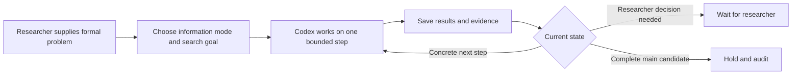

# Geometry and Mathematics Research Workspace

Continue mathematical research across sessions with a reviewable record of the evidence.

[](https://github.com/coker412/graph-geometry-research-workspace/actions/workflows/ci.yml)
[](LICENSE)

This workspace helps researchers use Codex for proof search, counterexample construction, literature checks, and reproducible experiments. Each project keeps its problem, approaches, evidence, failed attempts, and next steps on disk, so work can continue without relying on an ever-growing chat history.

It supports Riemannian geometry, geometric analysis, discrete and graph geometry, and other mathematical fields defined by each project. The existing repository and directory names remain unchanged for compatibility.

[Quick start](#quick-start) · [Example](#a-complete-example) · [Features](#features) · [Research modes](#research-modes) · [Evidence and publication](#evidence-and-publication)

## Who this is for

Individual researchers and small teams working on problems that require several approaches, repeated counterexample tests, or many sessions. The workspace distinguishes candidate proofs from computational observations, published results, and researcher acceptance. A queue can rotate among several problems or run one problem in a dedicated background session.

The framework organizes research; it does not guarantee a correct proof or provide its own model. Researchers remain responsible for definitions, proof review, and publication decisions. It calls an installed, authenticated Codex CLI.

## Quick start

### 1. Get the workspace

```bash
git clone https://github.com/coker412/graph-geometry-research-workspace.git
cd graph-geometry-research-workspace
```

You can also use **Use this template** on GitHub to create your own copy.

### 2. Check your environment

```bash
./setup.sh --check
```

The basic runtime needs Git, Bash, Python 3, Codex CLI, and tmux for background sessions. Computation uses the Conda environment `graphlab` by default. To bootstrap the environment without the optional Rethlas installation:

```bash
./setup.sh --bootstrap --without-rethlas
```

Authorize network installation and sign in with your own account. Do not copy another person's Codex login directory.

### 3. Add a problem

```bash
./queue.sh add my-problem "My conjecture"
```

Fill in `problems/important-conjectures/items/my-problem/problem.md`, review the adjacent `config.toml`, and set:

```toml
ready = true
```

The researcher owns the formal problem. The runner saves input snapshots; research agents must not rewrite the original statement.

### 4. Try one round

```bash
./queue.sh check
./queue.sh once
```

`check` inspects the environment and next eligible problem without calling Codex. `once` runs one bounded research step, allowing you to check the problem, permissions, and output structure.

### 5. Run in the background

```bash
./queue.sh start
./queue.sh status   # Inspect status.
./queue.sh watch    # View output; detach with Ctrl-b, then d.
./queue.sh stop     # Stop safely after the current round.
```

Background sessions use tmux and survive a closed terminal. Sleep or shutdown pauses or stops computation. Saved state remains available for a later restart.

## A complete example

[`examples/tree-edge-count/`](examples/tree-edge-count/) is a synthetic project about the statement that a finite nonempty tree on $n$ vertices has $n-1$ edges. It contains no private research and shows how the records fit together:

```text
problem.md
    ↓
CURRENT_STATE.md
    ↓
ideas.md + research-tree.md + proof-map.md
    ↓
notes/proof.md
    ↓
verification-ledger.md + progress.md
```

Its candidate proof remains `proof-draft`. An apparently complete argument does not automatically become a result accepted by a human researcher.

## Features

| Research need | Workspace support |
|---|---|
| Resume in a new session | `CURRENT_STATE.md` records scope, gaps, and evidence pointers |
| Avoid repeating failed approaches | `ideas.md` and `research-tree.md` record mechanisms, failures, and reopening conditions |
| Track unverified dependencies | `proof-map.md` and `verification-ledger.md` preserve dependencies and evidence levels |
| Keep experiments distinct from proofs | Computational evidence is initially `experimental` |
| Allocate time among problems | Fair queue rotation and dedicated single-problem runners |
| Review a complete candidate | A global hold pending certification and researcher review |
| Continue a mathematical task across calls | `tools/research_tasks.py` retains the original acceptance criteria and outstanding obligations |
| Reuse known results | Scoped literature comparisons and explicit application checks |
| Try another formulation at a bottleneck | `agents/protocols/cross-field.md` requires a mathematical connection and an actual test |
| Track context and usage | `tools/research_runtime.py` and `./queue.sh usage` |
| Compare plans with results | `tools/research_progress.py` and `./queue.sh progress` |
| Prepare papers and study companions | The two skills under `.agents/skills/` |
| Check public releases | GitHub Actions, source manifests, and distribution checks |

## How research proceeds


```mermaid
flowchart LR
    A[Researcher supplies formal problem] --> B[Choose information mode and search goal]
    B --> C[Codex works on one bounded step]
    C --> D[Save results and evidence]
    D --> E{Current state}
    E -->|Concrete next step| C
    E -->|Researcher decision needed| F[Wait for researcher]
    E -->|Complete main candidate| G[Hold and audit]
```

Each call has a bounded scope. Long-running research consists of successive calls and persistent state. Each round must leave a reviewable artifact: a derivation, precise gap, candidate construction, failed approach with a reason, or reproducible experiment.

A mathematical task can span several calls. Proving a convenient auxiliary lemma does not replace the original acceptance criteria: the agent must try to apply it to the main problem and record the remaining obligations. Repeated self-reports at the same obstacle trigger a comparison of mechanisms, without claiming independently verified stagnation.

Ordinary rounds use one researcher. Additional agents require an explicit request. Configured `mixed-isolated` runs use isolated branches followed by integration. Important auxiliary candidates receive stronger checks and retain conditional dependencies; complete main candidates require whole-problem certification and a pause.

`AGENTS.md` contains the shared rules. `agents/core/` and `agents/protocols/` supply instructions for the current phase; `agents/instructions/` contains compatibility indexes, research guidance, and paper rules. Load only the relevant modules.

## Research modes

Information access, search goal, scheduling, duration, and phase are separate choices.

| Dimension | Options | Purpose |
|---|---|---|
| Information access | `offline`, `connected`, `mixed-isolated` | Control external sources and provenance |
| Agent strategy | `single`, `adaptive`, `swarm` | Describe authorized branch use; not a runner configuration field |
| Search goal | `affirmative-proof`, `counterexample`, `either` | Search for a proof, a counterexample, or either |
| Scheduling | One round, fair queue, dedicated problem | Allocate execution time |
| Duration | Bounded trial or continuous run | Set call timeouts, attempt limits, and wall time |
| Phase | Exploration or certification | Choose checks appropriate to the evidence |

### Information access

- `offline` uses the formal problem, permitted background facts, internal computation, and traceable state. It cannot establish literature status or novelty.
- `connected` permits external checks. Read original theorem statements and match all hypotheses and normalizations.
- `staged` is a manual workflow: freeze an offline route snapshot before switching to connected checking.
- `mixed-isolated` runs offline and connected branches, then an integration audit. It usually takes three Codex calls and requires Linux `bubblewrap`. Missing isolation tools cause refusal rather than a silent fallback.

Global settings live in `problems/important-conjectures/runner.toml`; a problem's `config.toml` can override them:

```toml
information_mode = "offline"
search_contract = "either"
```

### Scheduling

| Task | Command |
|---|---|
| Check without starting research | `./queue.sh check` |
| Run one round on the next problem | `./queue.sh once` |
| Rotate among eligible problems | `./queue.sh start` |
| Focus on one problem in the background | `./queue.sh start --slug <slug>` |
| View that problem's session | `./queue.sh watch --slug <slug>` |
| Stop it safely | `./queue.sh stop --slug <slug>` |

Different slugs can use separate tmux sessions. A slug cannot have two runners, and the fair queue must not modify a problem already owned by a dedicated runner.

### Continuous research

Set a problem's `max_attempts = 0` to remove the cumulative attempt limit. Set global `max_wall_hours = 0` to remove the wall-time limit for one background run. Keep a finite call timeout to recover from CLI failures or stalled computations.

Only `queued` and `pushing` problems rotate automatically. Ambiguity, required external approval, runtime failures, or a complete main candidate can cause a hold. Continuous scheduling consumes model quota and does not guarantee a solution.

See the [queue guide](problems/important-conjectures/README.md) for configuration, prompts, and recovery.

## Project records

On first execution, the runner creates:

```text
projects/conjecture-<slug>/
├── README.md
├── CURRENT_STATE.md
├── references.md
├── ideas.md
├── progress.md
├── research-tree.md
├── proof-map.md
├── verification-ledger.md
├── notes/
├── code/
├── lean/
├── rethlas/
├── input-snapshots/
├── CURRENT_INPUT.md
└── .conjecture-status
```

The current workflow uses natural-language proofs and reproducible calculations. The historical `lean/` directory does not require formalization.

### Short state and history

`CURRENT_STATE.md` is the recovery entry point: target 6 KiB, warning above 8 KiB, V2 limit 12 KiB/300 lines. Legacy summaries retain a temporary 32 KiB/300-line limit. Read the formal problem and short state first, then follow stable IDs and direct evidence pointers.

For existing queue projects:

```bash
./queue.sh state-init
./queue.sh state-audit
```

For projects outside the queue:

```bash
./tools/project_state.py init
./tools/project_state.py audit
```

Initialization does not overwrite existing summaries. Legacy projects begin with `migration-status: pending`; migration checks the latest complete round and cited evidence. Unread history stays unknown, and migration cannot upgrade evidence.

### Disk maintenance

```bash
./queue.sh hygiene report
./queue.sh hygiene latex
./queue.sh hygiene logs --older-than-days 30 --keep-latest-per-slug 5
```

These commands report or preview changes by default. Explicit `--apply` is required to remove reproducible LaTeX intermediate files or losslessly compress old JSONL logs. Project environments are never deleted automatically.

## Context and usage

The runner selects effort by phase and compiles the relevant rules, problem, short state, and evidence slices into a research packet. A packet exceeding its hard limit is rejected before a model call. Existing routes continue from the current gap without repeatedly loading the full history.

```bash
./queue.sh packet --slug <slug>        # Preview initial context size.
./queue.sh usage                       # Summarize recorded usage.
./queue.sh usage --slug <slug> --json  # Inspect structured statistics.
./queue.sh progress --slug <slug>     # Compare plans and reported results.
```

Input, cached input, output tokens, and elapsed time are separate measurements. Missing usage remains unknown. Context budgets measure UTF-8 bytes and constrain only the initial packet; they are not billing limits. This workspace does not calculate a monetary bill or claim experimentally established savings.

The [runtime guide](shared/runtime-v2-guide.md) explains budgets, transactions, and recovery. The [progress guide](shared/research-progress-guide.md) distinguishes mathematical progress from execution status and self-reported activity. Usage statistics and structural checks cannot raise evidence levels.

## Papers and Chinese study editions

The repository and distribution include two skills with supporting resources:

- [math-paper-writing](.agents/skills/math-paper-writing/SKILL.md): theorem and proof exposition, citations, bilingual consistency, LaTeX, figures, and submission materials.
- [math-paper-study-guide](.agents/skills/math-paper-study-guide/SKILL.md): a Chinese companion to a stable source, with staged reading, prerequisites, expanded calculations, checkpoints, and proof reconstruction.

Invoke `$math-paper-writing` or `$math-paper-study-guide` and identify the source files. The documentation is in English; the study-guide skill intentionally produces Chinese teaching material when requested.

Follow the [paper rules](agents/instructions/paper-writing.md). Active and candidate manuscript files and their build outputs belong under the owning project's `paper/` directory from the first write. Rebuild affected versions and inspect the logs. Language and layout checks do not verify a proof.

## Evidence and publication

| Level | Meaning |
|---|---|
| `conjecture` | No proof |
| `experimental` | Computational evidence only |
| `partial-result` | A special case or weaker conclusion |
| `proof-draft` | A complete candidate argument awaiting rigorous verification |
| `agent-verified` | Independent agent or verifier review |
| `human-verified` | Stepwise review and explicit acceptance by the researcher |
| `formalized` | Formal-system checks; preserve historical evidence labels |

Computation alone cannot establish a theorem. Self-review is not independent verification. Model strength, prose editing, and state maintenance cannot raise evidence levels. Unqualified main results in a submission manuscript require `human-verified` or `formalized` evidence and researcher authorization.

### Public distribution boundary

This repository publishes the framework, templates, tools, tests, reusable writing skills, and a synthetic example. Research directories contain placeholders; `shared/` additionally contains the two public runtime guides. The hidden `.agents/` directory contains only explicitly allowlisted skill resources.

Private papers, research records, logs, environments, and credentials are excluded. The public repository is the source for distributable framework releases; private workspaces may keep local extensions, but must never be copied recursively into it.

Before committing:

```bash
python tools/update_manifest.py write
./tools/verify_teacher_framework.sh --public-source
python -m unittest discover -s tools/tests -v
python .agents/skills/math-paper-writing/scripts/check_skill_resources.py
```

The checks cover manifests, private-data boundaries, prohibited file types, common secret patterns, and allowlisted skill resources. GitHub Actions repeats the checks and exercises a full distribution export on pushes and pull requests.

## Optional Rethlas integration

The ordinary queue needs only Codex. Rethlas is an optional proof-generation and verification tool for precisely stated gaps. Install it outside the workspace and obtain explicit authorization for each run.

The queue never starts Rethlas automatically. A generated argument does not by itself establish that the problem is solved. See the [Rethlas guide](RETHLAS使用教程.md) for preparation, tmux sessions, and importing results. Its existing filename is retained for script compatibility.

## Documentation

- [Queue quick start](TEACHER_QUEUE_QUICKSTART.md)
- [Environment setup](TEACHER_SETUP_README.md)
- [Framework handoff](TEACHER_FRAMEWORK_HANDOFF.md)
- [Queue configuration and recovery](problems/important-conjectures/README.md)
- [Research rules](AGENTS.md)
- [AI setup instructions](SETUP_AI_PROMPT.md)
- [Geometric objects and conventions](agents/protocols/geometry-scope.md)
- [Personal research workflow](agents/instructions/personal-research.md)

## License

MIT. You may copy, modify, and redistribute the framework while retaining the copyright and license notice.
