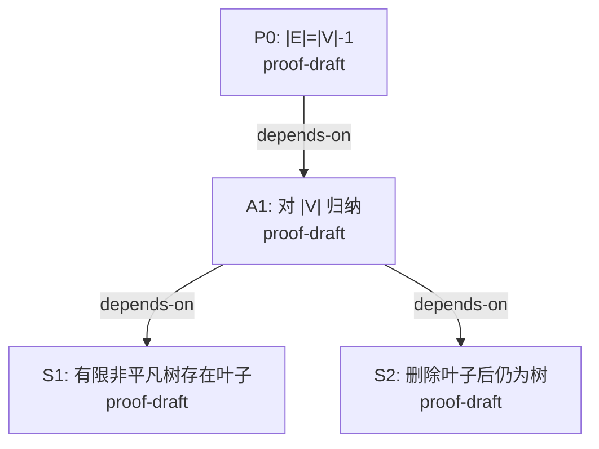

# Proof Map

| Node | 命题 | 来源 | 证据等级 | 证据 | 当前 gap |
|---|---|---|---|---|---|
| P0 | 有限非空树满足 \(|E|=|V|-1\) | internal-offline | proof-draft | `notes/proof.md` | 缺少独立审查 |
| A1 | 删叶归纳覆盖所有 \(|V|\ge 1\) | internal-offline | proof-draft | `notes/proof.md` | 缺少独立审查 |
| S1 | \(|V|\ge 2\) 时存在度为 1 的顶点 | internal-offline | proof-draft | `notes/proof.md` | 缺少独立审查 |
| S2 | 删除叶子及其关联边后仍为树 | internal-offline | proof-draft | `notes/proof.md` | 缺少独立审查 |
