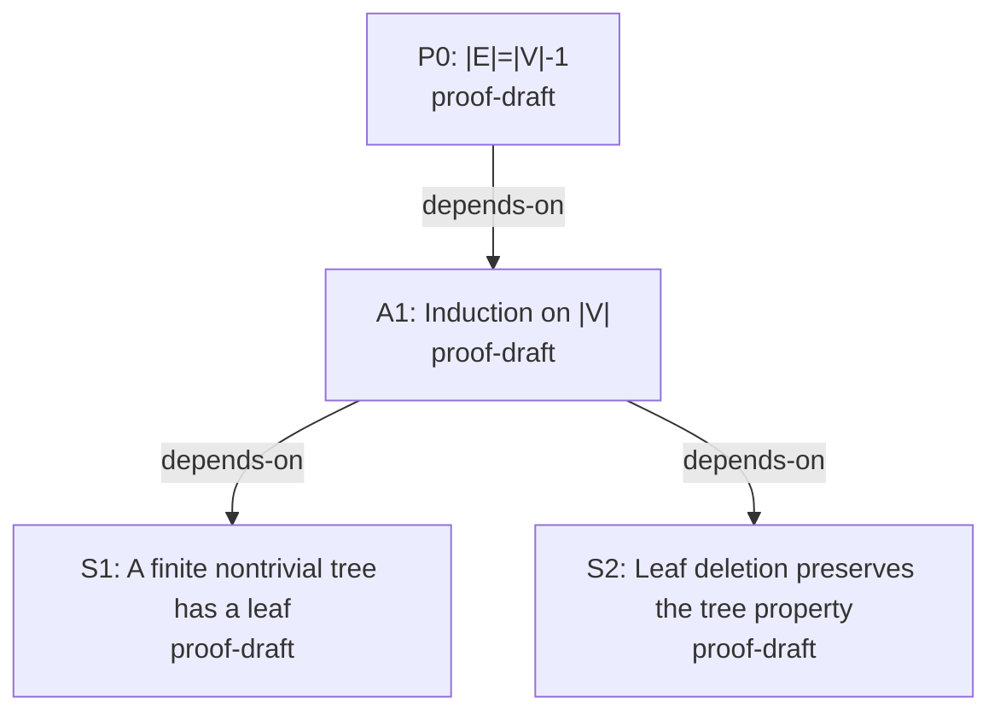

# Proof map

```mermaid
flowchart TD
    P0["P0: |E|=|V|-1<br/>proof-draft"]
    A1["A1: Induction on |V|<br/>proof-draft"]
    S1["S1: A finite nontrivial tree has a leaf<br/>proof-draft"]
    S2["S2: Leaf deletion preserves the tree property<br/>proof-draft"]
    P0 -->|depends-on| A1
    A1 -->|depends-on| S1
    A1 -->|depends-on| S2
```

| Node | Statement | Source | Level | Evidence | Gap |
|---|---|---|---|---|---|
| P0 | Edge count is vertex count minus one | internal-offline | proof-draft | `notes/proof.md` | Independent review pending |
| A1 | Leaf-deletion induction covers every nonempty finite tree | internal-offline | proof-draft | `notes/proof.md` | Independent review pending |
| S1 | A tree with at least two vertices has a degree-one vertex | internal-offline | proof-draft | `notes/proof.md` | Independent review pending |
| S2 | Deleting a leaf and its incident edge leaves a tree | internal-offline | proof-draft | `notes/proof.md` | Independent review pending |
