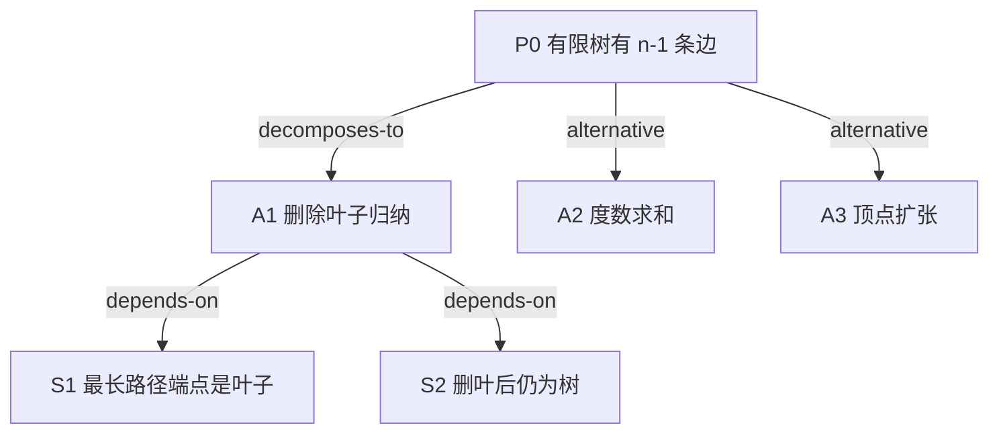

# Research Tree

```mermaid
flowchart TD
    P0["P0 有限树有 n-1 条边"]
    A1["A1 删除叶子归纳"]
    A2["A2 度数求和"]
    A3["A3 顶点扩张"]
    S1["S1 最长路径端点是叶子"]
    S2["S2 删叶后仍为树"]

    P0 -->|decomposes-to| A1
    P0 -->|alternative| A2
    P0 -->|alternative| A3
    A1 -->|depends-on| S1
    A1 -->|depends-on| S2
```

- `A1`: 已推进到 `proof-draft`。
- `A2`: 保留为对照路线，尚未推进。
- `A3`: 保留为构造性路线，尚未推进。
