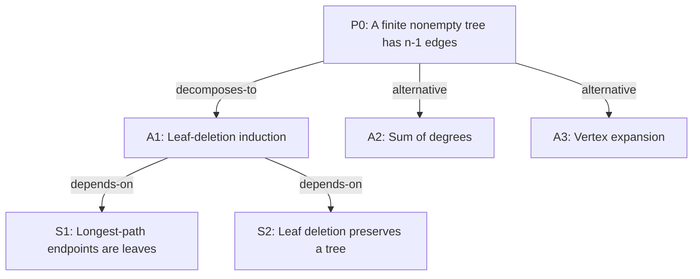

# Research tree

```mermaid
flowchart TD
    P0["P0: A finite nonempty tree has n-1 edges"]
    A1["A1: Leaf-deletion induction"]
    A2["A2: Sum of degrees"]
    A3["A3: Vertex expansion"]
    S1["S1: Longest-path endpoints are leaves"]
    S2["S2: Leaf deletion preserves a tree"]
    P0 -->|decomposes-to| A1
    P0 -->|alternative| A2
    P0 -->|alternative| A3
    A1 -->|depends-on| S1
    A1 -->|depends-on| S2
```

- `A1`: developed to `proof-draft`.
- `A2`: retained as an undeveloped comparison route.
- `A3`: retained as an undeveloped constructive route.
