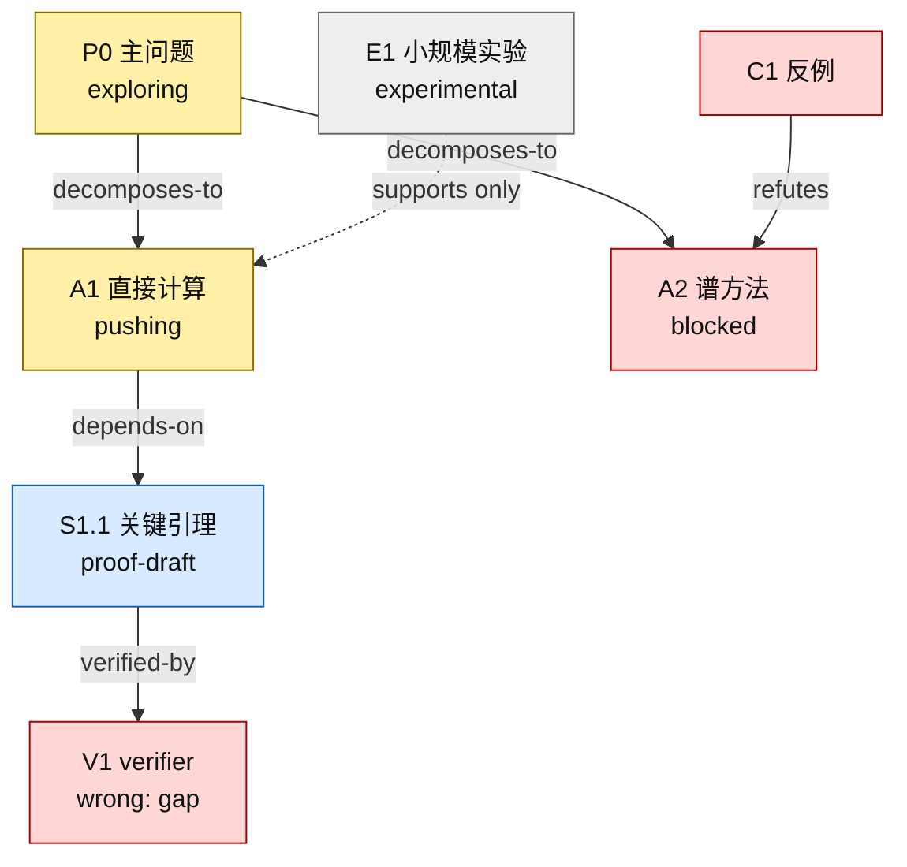
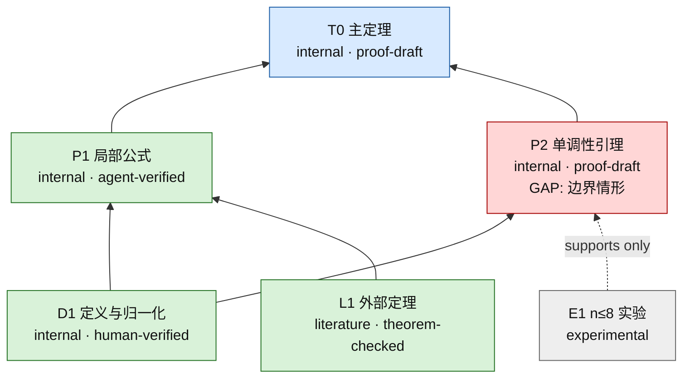

# 研究路线与证明依赖可视化模板

将下面两个部分分别复制为项目中的 `research-tree.md` 和 `proof-map.md`。

## research-tree.md：探索过程

### 当前状态

- 主问题：
- 当前主路线：
- 最新关键事件：
- 最大障碍：
- 下一步：

### 路线图

### 分支卡片

#### A1 — 路线名称

- 状态：`pushing`
- 核心直觉：
- 有序子目标：
- 支持证据：
- 当前障碍：
- 对应日志：
- 下一步：

#### A2 — 路线名称

- 状态：`blocked`
- 失败位置：
- 失败类型：
- 反例或证据：
- 可复用观察：

---

## proof-map.md：候选证明依赖

### 当前状态

- 目标定理：
- 当前证据等级：
- 当前最小缺口：
- 候选证明文件：
- 最近一次验证报告：

### 依赖图

### 节点登记表

| ID | 命题 | 来源 | 证据等级 | 证明/来源文件 | 验证状态 | 下游影响 |
|---|---|---|---|---|---|---|
| D1 | 定义与归一化 | internal | human-verified | `README.md` | closed | P1, P2 |
| L1 | 外部定理 | literature | theorem-checked | `references.md#L1` | closed | P1 |
| P1 | 局部公式 | internal | agent-verified | `notes/local-formula.md` | closed | T0 |
| P2 | 单调性引理 | internal | proof-draft | `notes/monotonicity.md` | gap | T0 |
| T0 | 主定理 | internal | proof-draft | `notes/main-proof.md` | blocked by P2 | — |

### 未关闭缺口

#### GAP-P2-1

- 位置：
- 所需结论：
- 已尝试路线：
- 反例测试：
- 影响节点：
- 下一步：
