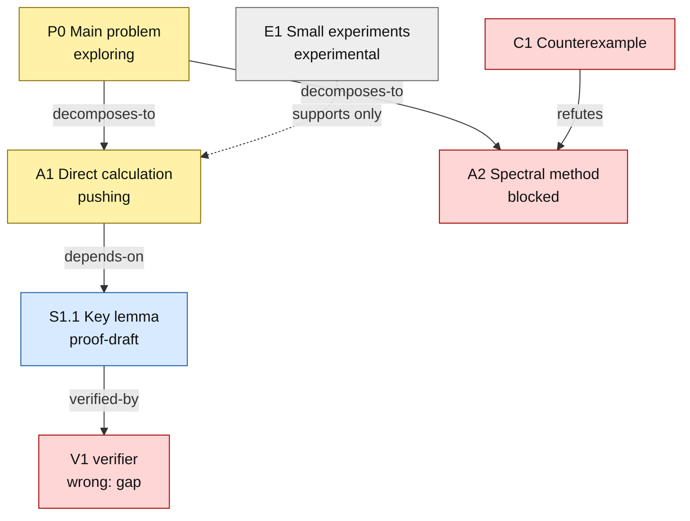
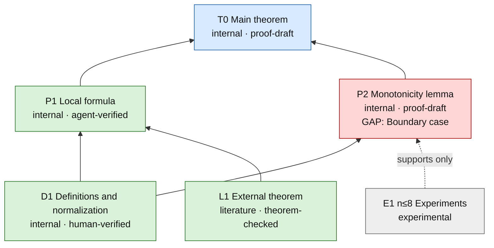

# Research routes and proof dependencies

Copy the two sections below into the project files `research-tree.md` and `proof-map.md`.

## research-tree.md: Exploration

### Current state

- Main problem:
- Current main route:
- Latest important event:
- Main obstacle:
- Next step:

### Route diagram

```mermaid
flowchart TD
    P0["P0 Main problem<br/>exploring"]
    A1["A1 Direct calculation<br/>pushing"]
    A2["A2 Spectral method<br/>blocked"]
    E1["E1 Small experiments<br/>experimental"]
    C1["C1 Counterexample"]
    S11["S1.1 Key lemma<br/>proof-draft"]
    V1["V1 verifier<br/>wrong: gap"]

    P0 -->|decomposes-to| A1
    P0 -->|decomposes-to| A2
    E1 -.->|supports only| A1
    C1 -->|refutes| A2
    A1 -->|depends-on| S11
    S11 -->|verified-by| V1

    classDef active fill:#fff2a8,stroke:#8a6d00,color:#111;
    classDef blocked fill:#ffd6d6,stroke:#a40000,color:#111;
    classDef partial fill:#d8eaff,stroke:#1d5fa7,color:#111;
    classDef verified fill:#d9f2d9,stroke:#267326,color:#111;
    classDef evidence fill:#eeeeee,stroke:#666,color:#111;

    class P0,A1 active;
    class A2,C1,V1 blocked;
    class S11 partial;
    class E1 evidence;
```

### Branch records

#### A1: Route name

- Status: `pushing`
- Main idea:
- Ordered subgoals:
- Supporting evidence:
- Current obstacle:
- Related log:
- Next step:

#### A2: Route name

- Status: `blocked`
- Failure location:
- Failure type:
- Counterexample or evidence:
- Reusable observation:

---

## proof-map.md: Candidate proof dependencies

### Current state

- Target theorem:
- Current evidence level:
- Smallest current gap:
- Candidate proof file:
- Latest verification report:

### Dependency graph

```mermaid
flowchart BT
    D1["D1 Definitions and normalization<br/>internal · human-verified"]
    L1["L1 External theorem<br/>literature · theorem-checked"]
    P1["P1 Local formula<br/>internal · agent-verified"]
    P2["P2 Monotonicity lemma<br/>internal · proof-draft<br/>GAP: Boundary case"]
    T0["T0 Main theorem<br/>internal · proof-draft"]
    E1["E1 n≤8 Experiments<br/>experimental"]

    D1 --> P1
    L1 --> P1
    D1 --> P2
    P1 --> T0
    P2 --> T0
    E1 -.->|supports only| P2

    classDef verified fill:#d9f2d9,stroke:#267326,color:#111;
    classDef draft fill:#d8eaff,stroke:#1d5fa7,color:#111;
    classDef gap fill:#ffd6d6,stroke:#a40000,color:#111;
    classDef experimental fill:#eeeeee,stroke:#666,color:#111;

    class D1,L1,P1 verified;
    class T0 draft;
    class P2 gap;
    class E1 experimental;
```

### Node register

| ID | Statement | Source | Evidence level | Proof/source file | Verification status | Downstream effect |
|---|---|---|---|---|---|---|
| D1 | Definitions and normalization | internal | human-verified | `README.md` | closed | P1, P2 |
| L1 | External theorem | literature | theorem-checked | `references.md#L1` | closed | P1 |
| P1 | Local formula | internal | agent-verified | `notes/local-formula.md` | closed | T0 |
| P2 | Monotonicity lemma | internal | proof-draft | `notes/monotonicity.md` | gap | T0 |
| T0 | Main theorem | internal | proof-draft | `notes/main-proof.md` | blocked by P2 | None |

### Open gaps

#### GAP-P2-1

- Location:
- Required conclusion:
- Attempts:
- Counterexample tests:
- Affected nodes:
- Next step:
